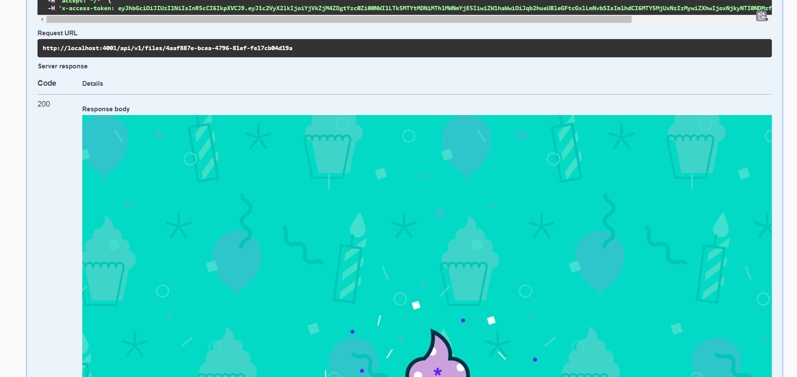
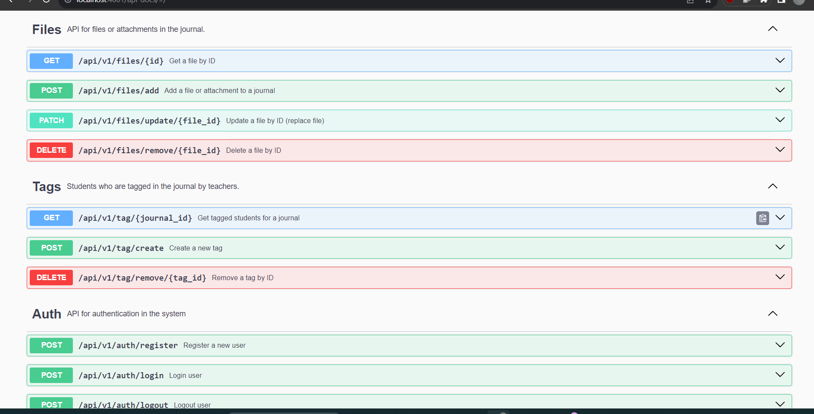
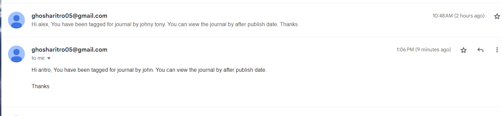
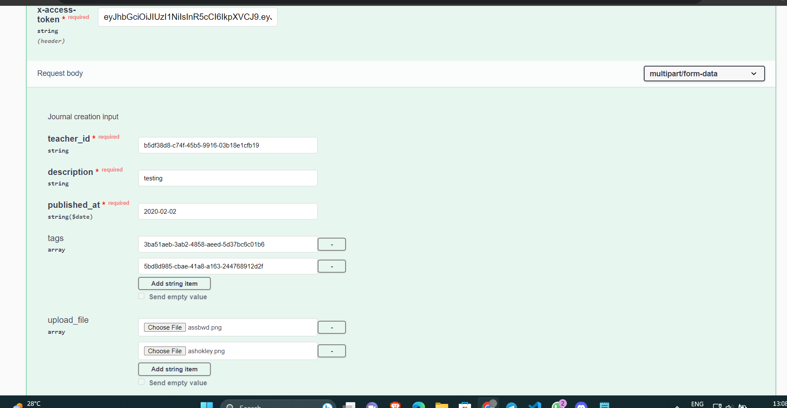
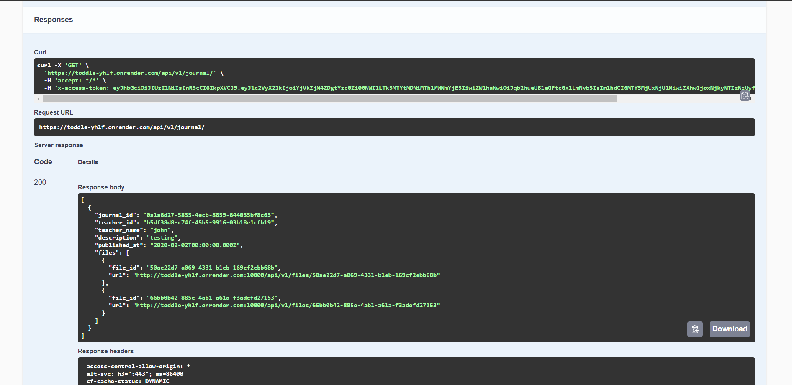
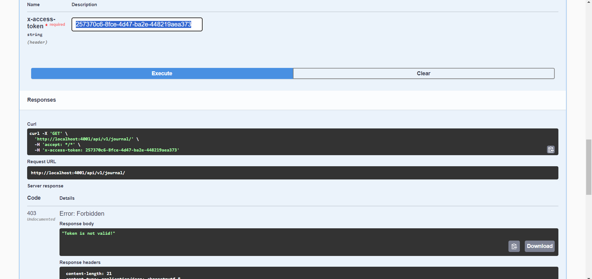
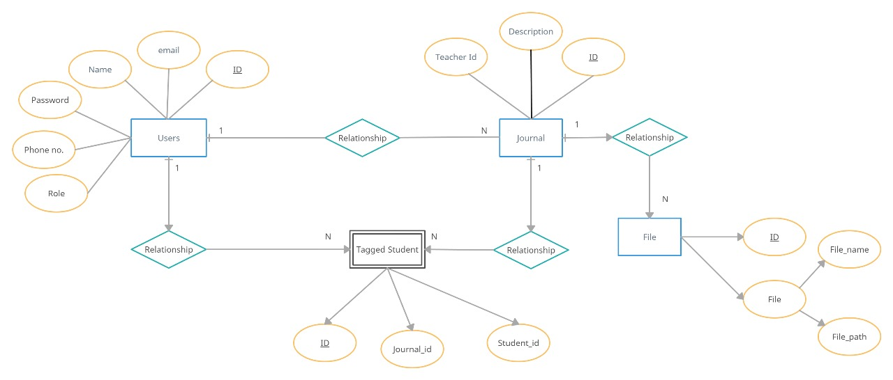

# Introduction

Hello! I'm **Aritro Ghosh**, and I'm excited to present my solution for the backend assignment. This microservice is designed to provide a secure and efficient journal management system with a focus on user authentication and authorization.

# Technologies Used

- Language: Node.js
- Framework: Express.js
- Database: MySQL
- Authentication & Authorization: JSON Web Tokens (JWT)
- Documentation: Swagger
- Email Notifications: Nodemailer

# Setup Instructions

1. Unzip the assignment package.
2. Install Node.js and MySQL.
3. Navigate to the unzipped directory in your terminal.
4. run `npm i`
5. run `npm start`
6. To access the API documentation, open your browser and go to the URL: `http://localhost:4001/api-docs`. (Note: Replace 4001 with the appropriate port if you've configured a different one.)
7. You can check all the end points in the docs.

# Additional Features

- Notifications:
  The system sends notifications to students when they are tagged in a journal using Gmail.

# Configuration

The application's environment variables are stored in the `.env` file. Modify these variables to suit your needs (e.g., database settings, email configuration).

# Screenshots

some screenshots of key functionalities:

# ER Diagram

# Deployment

I have deployed the project on Render and used cloud mysql server (both are free tier, may experience slow performance). You can access the deployed project at Deployment Link.

Link: https://toddle-yhlf.onrender.com

# Conclusion

This microservice provides a secure and user-friendly platform for managing classroom journals. It offers features like user authentication, teacher-exclusive journal creation and management, student feeds, and email notifications. The use of JWT ensures data security, and the documentation provided via Swagger makes API interactions intuitive.
